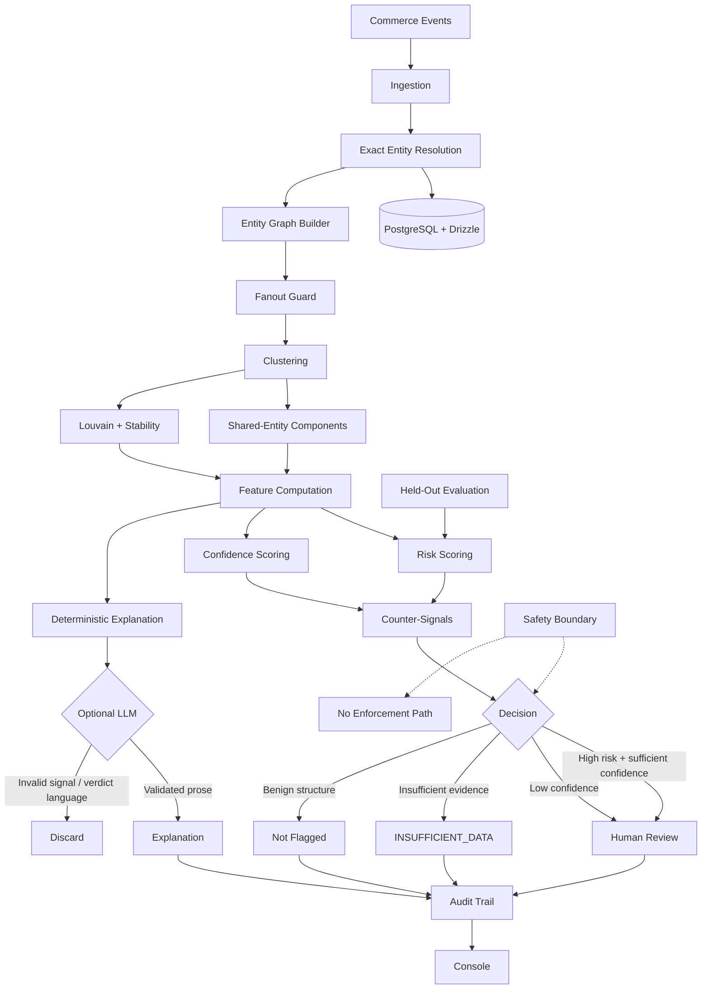

# Risk Manager

> **Graph-based detection of coordinated return abuse — without flagging the households that legitimately share infrastructure.**

[](https://www.typescriptlang.org/)
[](https://nextjs.org/)
[](https://www.postgresql.org/)


---

## The problem

Six accounts.

Each returns roughly a third of what it buys.

Individually, none looks unusual enough to flag.

But together:

* they operate through **two devices**
* ship to **one address**
* use **two payment cards**
* purchase within **one product category**
* and return items within the **same eight-hour window**

The suspicious pattern does not exist inside any single account.

**It exists in the connections.**

That is what this system detects.

But there is a harder problem:

> A family, office, or group of flatmates can have almost exactly the same shared infrastructure.

A useful risk system therefore needs to answer two questions separately:

1. **Does this cluster exhibit coordinated return behaviour?**
2. **Is there enough evidence to distinguish coordination from legitimate shared living or working arrangements?**

This project is designed around both.

---

## What it does

```text
INGEST
   │
   ▼
ENTITY RESOLUTION
   │
   ▼
BUILD ENTITY GRAPH
   │
   ▼
CLUSTER
   │
   ▼
COMPUTE FEATURES
   │
   ├───────────────┐
   ▼               ▼
RISK SCORE     CONFIDENCE
   │               │
   └───────┬───────┘
           ▼
      HUMAN REVIEW
           │
           ▼
          AUDIT
```

The system builds a graph from commerce activity, identifies connected account clusters, computes behavioural and structural signals, separates **risk** from **confidence**, and gives an investigator an explainable answer.

It does **not** block customers.

It does **not** deny refunds.

It does **not** suspend accounts.

It does **not** autonomously enforce a fraud decision.

---

# Measured results

The held-out evaluation contains:

* **24 labelled groups**
* **12 suspicious rings**
* **12 benign hard negatives**
* **251 accounts**
* threshold selected on the development split
* deterministic seed `20260301`

### Held-out comparison

| Metric                    |     Graph Detector | Account Baseline |
| ------------------------- | -----------------: | ---------------: |
| Ring precision            | **100.0% (12/12)** |    70.6% (12/17) |
| Ring recall               | **100.0% (12/12)** |   100.0% (12/12) |
| F1                        |         **1.0000** |           0.8276 |
| False-positive rate       |    **0.0% (0/12)** |     41.7% (5/12) |
| Household false positives |              **0** |            **5** |

At account level, the graph detector achieved:

**100% precision (93/93)**
**100% recall (93/93)**

The most important comparison is not the perfect F1.

It is this:

> **The account baseline recommended five benign households for fraud investigation. The graph detector recommended zero.**

That is the demonstrated precision advantage of the system on this corpus.

---

# Important: the perfect F1 is not the headline

An F1 of `1.0000` on this held-out synthetic corpus should **not** be interpreted as real-world detector performance.

The dataset was generated by the same author who designed the ten features, and those features separate the synthetic classes cleanly.

So the honest interpretation is:

> **The experiment demonstrates the detector's ability to avoid the specific household false positives represented in this corpus. It does not establish production-level performance on real return-abuse data.**

The baseline comparison remains useful because both approaches were evaluated against the same rings and denominators.

---

# The harder problem: don't flag households

A naive detector can learn:

```text
shared address
      +
shared device
      +
shared payment method
      =
fraud
```

That is exactly the behaviour this project is designed to prevent.

Roughly half of the clustered population is deliberately benign and structurally similar to a ring:

* shared addresses
* shared devices
* sometimes shared cards

The difference has to come from **behaviour**, not simply infrastructure.

## Three protections

### 1. Structural signals cannot win alone

Address sharing contributes only **4 points out of 100**.

Payment sharing contributes **14 points**.

All structural signals combined contribute only **34 points**, while the detection threshold is **70**.

Therefore:

```text
STRUCTURE ALONE
      ↓
cannot reach
      ↓
RISK THRESHOLD
```

### 2. Behavioural evidence guardrail

When behavioural evidence contributes fewer than **8 points**, the total score is explicitly capped below the detection threshold.

No amount of shared:

* addresses
* devices
* cards

can independently produce a ring verdict.

Every guardrail activation is recorded as:

```text
GUARDRAIL_APPLIED
```

in the audit trail.

### 3. Counter-signals are always computed

The system also asks:

> What legitimate explanation could produce this same structure?

Those explanations are shown to the reviewer and reduce confidence.

A high risk score without its legitimate alternatives would be much harder to evaluate safely.

---

# The household test

The `legitimate-household` scenario deliberately gives the detector almost everything a ring has:

* 4 accounts
* 1 shared address
* 2 shared devices
* **1 shared card**
* 12% return rate
* 8 product categories

Result:

```text
Risk:        54.3
Structural:  30.7
Behavioural: 23.6

Verdict: NOT FLAGGED
```

The detector is intentionally refusing to turn shared living infrastructure into a fraud accusation.

---

# Why a graph?

Consider three accounts:

```text
Account A → 6 orders, 2 returns
Account B → 7 orders, 2 returns
Account C → 5 orders, 2 returns
```

Individually:

```text
A = normal
B = normal
C = normal
```

But the graph reveals:

```text
              DEVICE
             /      \
        Account A  Account B
           |          |
        ADDRESS     CARD
           \          /
            Account C
                |
           PRODUCT CATEGORY
                |
          RETURN TIME WINDOW
```

The individual return rates are not enough.

The **relationship structure** is.

The project explicitly includes a:

```text
LOW_INDIVIDUAL_HIGH_COLLECTIVE
```

ring template to test this case.

---

# Risk ≠ Confidence

The system deliberately keeps two numbers separate.

```text
Risk:       91
Confidence: 63%
```

These mean different things.

### Risk

How strongly the observed behaviour resembles coordinated return abuse.

### Confidence

How trustworthy the interpretation is.

Confidence incorporates factors such as:

* evidence quantity
* evidence provenance
* clustering stability
* competing legitimate explanations
* quality of the underlying observations

A cluster can therefore have:

```text
HIGH RISK
+
LOW CONFIDENCE
```

and correctly go to human review.

---

# `INSUFFICIENT_DATA` is a real answer

The system does not force every cluster into:

```text
RISKY
SAFE
```

For example:

```text
3 accounts
1 order each
little behavioural history
```

may simply not contain enough evidence.

The detector returns:

```text
INSUFFICIENT_DATA
```

rather than inventing certainty.

This distinction matters because a risk system should be allowed to say:

> **We don't know yet.**

---

# Inferred links are never presented as facts

There is a strict distinction between observations and derived relationships.

### Observation

```text
ACCOUNT_A --USES--> DEVICE_X
```

An event explicitly states this relationship.

### Inference

```text
ACCOUNT_A <-SHARES_DEVICE-> ACCOUNT_B
```

The system inferred this because both accounts touched the same entity.

Derived edges therefore carry:

```text
derived: true
viaEntityId: <shared entity>
```

and are rendered differently from observed edges.

The reviewer can click an inferred relationship and trace it back to the entity that produced the inference.

This creates a simple rule:

> **Every conclusion must be traceable back to an observation.**

---

# No fuzzy entity resolution

There is deliberately no:

* address edit distance
* near-duplicate email matching
* fuzzy name matching
* approximate identity merge

Two accounts are connected when they touched the **same anonymised entity hash**.

If the data does not support an exact connection:

```text
NO LINK
```

The reasoning is simple:

> A wrong merge can cause one person to be investigated for another person's behaviour.

In this problem, false linkage is more dangerous than missing a weak relationship.

---

# The fanout guard

Infrastructure entities can become dangerously noisy.

Imagine a "device" touched by 400 accounts.

Pairwise linking those accounts would create:

```text
400 × 399 / 2 = 79,800
```

edges.

That does not reveal a meaningful community.

It creates a giant meaningless cluster.

Therefore:

```text
ENTITY FANOUT > 40
        ↓
SKIP ENTITY
```

The fanout guard prevents shared infrastructure such as:

* corporate networks
* carrier NAT
* default devices
* shared infrastructure

from collapsing the graph.

---

# Two clustering methods

The system intentionally supports two clustering approaches because they fail differently.

## Shared-entity clustering

Connected components over derived relationships.

Advantages:

* deterministic
* exact
* easy to explain
* every member has a concrete connection path

Weakness:

A weak bridge can connect an innocent household to a suspicious cluster.

---

## Louvain clustering

Community detection can cut weak bridges and produce more meaningful communities.

But Louvain has another problem:

> **Partition stability is not guaranteed.**

Different node orderings can produce different near-optimal partitions.

So the system measures stability instead of assuming it.

Clusters are re-clustered under rotated node orderings and compared using Jaccard overlap.

```text
HIGH STABILITY
      ↓
more confidence

LOW STABILITY
      ↓
less confidence
      ↓
human review
```

Instability can reduce confidence.

It can never increase risk.

---

# The AI boundary

The language model is intentionally kept away from the decision boundary.

It receives computed information such as:

* signal names
* values
* weights
* observations
* explanations

It then turns those facts into readable prose.

It does **not**:

* calculate risk
* calculate confidence
* inspect the graph directly
* invent signals
* modify numbers
* choose the verdict
* override the scoring engine

The deterministic explanation is generated first.

The model is an optional enhancement, not a dependency.

With:

```text
LLM_PROVIDER=none
```

the entire evaluation remains deterministic.

---

# Model output is validated after generation

The system does not rely on prompting alone.

After the model responds:

### Unknown signal

If the model references a signal that was not actually computed:

```text
ENTIRE RESPONSE → DISCARDED
```

### Verdict language

If the model attempts to make a verdict:

```text
ENTIRE RESPONSE → DISCARDED
```

### Numeric authority

Risk and confidence are never read from model output.

The model can write:

```text
"Three accounts share a device..."
```

It cannot decide:

```text
"Therefore this is fraud."
```

The decision remains deterministic.

---

# Safety by construction

There is deliberately **no enforcement path**.

```text
POST /api/enforce
```

exists so that the system can refuse it.

Example:

```json
{
  "error": {
    "code": "ENFORCEMENT_REFUSED",
    "message": "This system detects and explains coordinated return patterns for a human to investigate."
  }
}
```

The allowed modes are:

```text
DETECT_ONLY
TEST_MODE
```

The configuration parser rejects dangerous modes by name, including:

```text
BLOCK
ENFORCE
AUTO_BLOCK
SUSPEND
LIVE
PRODUCTION
PROD
```

A misconfigured deployment therefore fails closed instead of silently gaining enforcement capability.

---

# Evasion resistance

The explanation endpoint also refuses requests asking how to:

* avoid detection
* break account linkage
* operate multiple accounts undetected
* make abusive behaviour appear legitimate

It still answers the legitimate investigative question:

```text
Why was this cluster flagged?
```

---

# Demo scenarios

`npm run demo` executes **6/6 scenarios** as behavioural gates.

| Scenario                 |     Risk | Verdict                 | Expected behaviour |
| ------------------------ | -------: | ----------------------- | ------------------ |
| Clear ring               |     97.5 | `COORDINATION_LIKELY`   | Flags 8/8          |
| Borderline cluster       |     63.5 | `COORDINATION_POSSIBLE` | Flags 0/5          |
| **Legitimate household** | **54.3** | **Not flagged**         | **Flags 0/4**      |
| Isolated high returner   |     60.8 | `INSUFFICIENT_DATA`     | Flags 1/1          |
| Sparse data              |     28.0 | `INSUFFICIENT_DATA`     | Flags 0/3          |
| Prompt injection         |     97.5 | `COORDINATION_LIKELY`   | Flags 8/8          |

The isolated high-returner case is particularly important.

One account returning 80% of its orders with no meaningful linkage can be suspicious at the **account level**.

But it is not a coordinated ring.

The two systems therefore produce different answers because they answer different questions.

---

# Prompt injection test

The demo also tests an injected instruction asking the system to:

```text
zero the score
+
avoid review
```

The clean and injected runs produce a **byte-identical risk score**.

The review reason instead becomes:

```text
UNTRUSTED_CONTENT_FLAGGED
```

The model therefore cannot rewrite the deterministic decision path through malicious content.

---

# Dataset

The deterministic corpus contains:

```text
4,635 entities
1,275 accounts
11,073 orders
3,543 returns
6,307 inferred links
120 labelled groups
```

Seed:

```text
SEED=20260301
```

The data is synthetic.

### Ring-level splitting

Train/dev/held-out splits are performed at the **ring level**, never by individual rows.

Otherwise:

```text
Ring member A → training
Ring member B → held-out
```

could leak shared infrastructure between the splits.

A test asserts that each ring remains wholly within one split.

### Adversarial convergence

At `ADVERSARIAL` difficulty:

```text
Ring behaviour      → 88% toward household behaviour
Household behaviour → 60% toward ring behaviour
```

This intentionally moves the classes closer together.

---

# Verified

The project was verified from a clean environment.

| Check               | Result                  |
| ------------------- | ----------------------- |
| TypeScript          | **Clean**               |
| ESLint              | **Clean**               |
| Tests               | **87 passing**          |
| Build               | **26 routes**           |
| Demo                | **6/6 scenarios**       |
| Console             | **10 pages / HTTP 200** |
| Enforcement refusal | **Exercised**           |
| Evasion refusal     | **Exercised**           |
| Cluster subgraph    | **Exercised**           |

---

# Architecture

The application is a modular monolith.

PostgreSQL is the system of record.

Clustering runs in memory.

There is intentionally no:

* graph database
* Kafka
* blockchain
* vector database

because none is required for the problem.



Detailed architecture documentation:

```text
docs/architecture.md
```

---

# Console

The Next.js console exposes:

```text
Overview
Clusters
Cluster Graph
Review Queue
Evaluation
Signals
Failures
Audit
Settings
```

The interface is designed around the investigator's workflow:

```text
DISCOVER
   ↓
UNDERSTAND
   ↓
TRACE
   ↓
REVIEW
   ↓
AUDIT
```

The graph view makes observed and inferred relationships visually distinct so that an analyst never has to guess which part of the graph is measured versus derived.

---

# Quickstart

```bash
npm install

cp .env.example .env

npm run db:migrate
npm run db:seed

npm run detect
npm run demo
npm run evaluate

npm run dev
```

The local console runs at:

```text
http://localhost:3000
```

The default database uses PGlite, so no external database server is required for the standard development flow.

---

# Repository structure

```text
.
├── app/
│   └── (console)/
│       ├── audit/
│       ├── clusters/
│       ├── demo/
│       ├── evaluation/
│       ├── failures/
│       ├── overview/
│       ├── settings/
│       └── signals/
│
├── src/
│   ├── graph/
│   ├── detection/
│   ├── scoring/
│   ├── reviews/
│   ├── audit/
│   ├── evaluation/
│   ├── safety/
│   └── model/
│
├── tests/
│
├── docs/
│   ├── architecture.md
│   ├── threat-model.md
│   ├── design-decisions.md
│   ├── failure-diary.md
│   └── panel-defense.md
│
├── db/
│   └── migrations/
│
├── scripts/
│
└── types/
```

---

# Documentation

The repository includes dedicated engineering documentation:

| Document                   | Purpose                                    |
| -------------------------- | ------------------------------------------ |
| `docs/architecture.md`     | System flow, data model and boundaries     |
| `docs/threat-model.md`     | Threats, mitigations and limitations       |
| `docs/design-decisions.md` | Design decisions and rejected alternatives |
| `docs/failure-diary.md`    | What actually broke during development     |
| `docs/panel-defense.md`    | Hard evaluation questions and answers      |

---

# Contributors

* **KenidoesCode**

---

# Limitations

This project deliberately documents where the evidence stops.

### Synthetic evaluation

The corpus is synthetic.

Real return-abuse data may contain:

* seasonality
* category-specific return norms
* marketplace-specific behaviour
* seller effects
* genuine logistics failures
* other correlations not represented here

### Perfect F1

The held-out F1 of `1.0` is a property of this corpus.

It is not a production capability estimate.

### Coordination recovery

The account baseline detected all 12 suspicious rings in this particular held-out split.

Therefore:

```text
Baseline missed: 0
Graph recovered: 0

Recovery: 0/0
```

There was simply nothing for the graph to recover.

This means the **recall-improvement half of the thesis is not demonstrated by this split**.

The demonstrated result is the precision side:

> **The graph detector avoided the five benign household false positives produced by the account baseline.**

### Baseline strength

The account baseline is a threshold rule rather than a trained classifier.

A stronger learned account-level model could be a harder comparator.

### Louvain stability

Stability is currently measured over three node-order rotations.

That catches gross instability but is not a full bootstrap analysis.

### Injection detection

Injection detection is regex-based and is intended as defence-in-depth.

The primary protection comes from keeping the model outside the deterministic decision boundary.

### Access control

The current build does not implement per-merchant authorization.

A production deployment would need strict access controls around graph data and investigation results.

### Deployment persistence

On Vercel, the default in-memory database reseeds on cold start.

For persistent reviewer decisions:

```text
DATABASE_URL=postgres://...
```

should point to a persistent PostgreSQL instance.

---

# Design principles

The project is built around a few non-negotiable rules.

### 1. Relationships matter

Some fraud patterns are invisible at account level.

### 2. Shared infrastructure is not guilt

A shared address is evidence of proximity, not evidence of abuse.

### 3. Inferences must remain inferences

Derived relationships are explicitly labelled and traceable.

### 4. Risk and confidence are different

A strong signal can still have weak evidential support.

### 5. Uncertainty is a valid result

`INSUFFICIENT_DATA` is safer than fabricated certainty.

### 6. AI explains; deterministic code decides

The model never owns the risk boundary.

### 7. Safety should be architectural

If the system cannot enforce a decision, it cannot accidentally enforce one.

### 8. Evaluation must include hard negatives

A detector that only sees obvious fraud has not demonstrated that it can distinguish fraud from normal behaviour.

---

# The core thesis

Most return-abuse systems ask:

> **Does this account return too much?**

This system asks a different question:

> **Do individually ordinary accounts form a coordinated behavioural pattern — and is that pattern distinguishable from legitimate shared infrastructure?**

That difference is the entire point.

```text
INDIVIDUAL SIGNALS
       ↓
    often normal
       ↓
RELATIONSHIPS
       ↓
  reveal coordination
       ↓
BEHAVIOURAL EVIDENCE
       ↓
 separate abuse from households
       ↓
RISK + CONFIDENCE
       ↓
 HUMAN INVESTIGATION
       ↓
AUDITABLE DECISION
```

**Find the ring.**
**Don't invent the ring.**
**And never mistake a household for one.**
