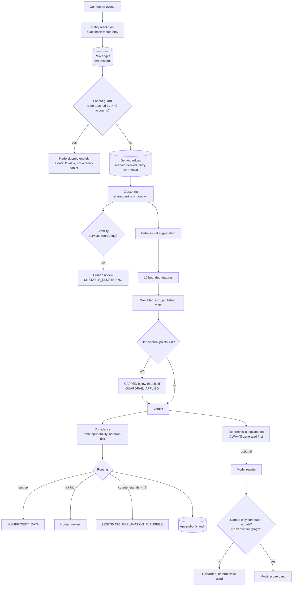
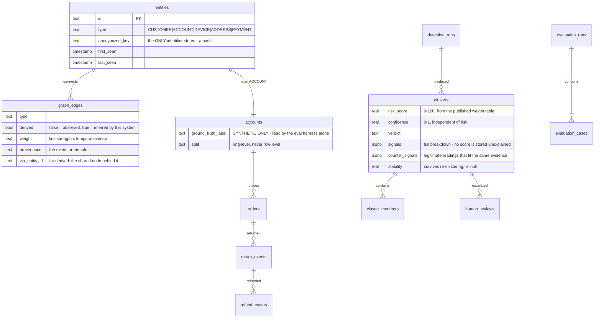
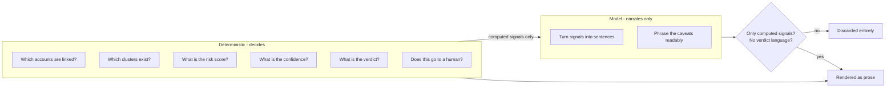
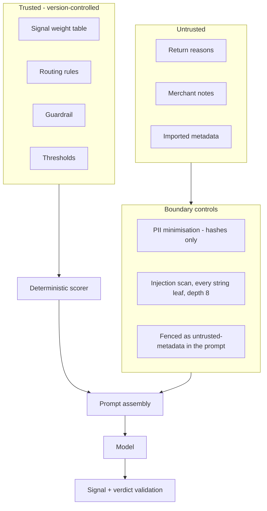
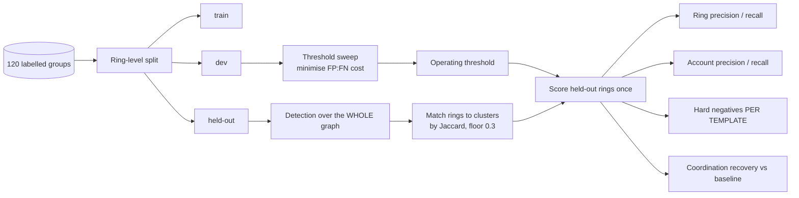

# Architecture

## System flow

The model sits at the far right of this diagram on purpose. Nothing it produces
feeds back into a score, a cluster or a verdict, and the validation gate runs
after it rather than trusting the prompt.

## Data model

`entities.anonymized_key` is the only identifier the system holds. There is no
column anywhere containing a raw address, device id or card number.

## The AI boundary

Everything on the left is arithmetic over stored events. The model receives the
*output* of that arithmetic and returns English. There is no arrow from AI back
into DET, and that is enforced by the call graph rather than by instruction.

## Security boundary

Precedence is `SYSTEM POLICY > APPLICATION RULES > COMPUTED SIGNALS > UNTRUSTED
TEXT`, and it holds because untrusted text cannot reach the scorer at all - not
because the model is asked to respect an ordering.

## Evaluation flow

Two choices here matter:

**Detection runs over the whole graph, not the split.** Restricting the graph to
one split would sever links to accounts elsewhere and change the structure being
measured. The split governs which rings are SCORED, not which entities exist.

**The threshold comes from dev.** Sweeping nine thresholds against held-out and
reporting the best is fitting a parameter to the test set. The held-out sweep is
still displayed, labelled as diagnostic.

## Module map

| Module | Responsibility | Reads ground truth? |
|---|---|---|
| `src/domain/vocabulary.ts` | Node/edge types, link strengths, verdicts | no |
| `src/graph/builder.ts` | Entity resolution, derived edges, fanout guard | no |
| `src/detection/clustering.ts` | Connected components, Louvain, stability | no |
| `src/detection/features.ts` | 10 bounded features | no |
| `src/scoring/risk.ts` | Weighted sum, guardrail, confidence, routing | no |
| `src/detection/baseline.ts` | Account-level comparator | no |
| `src/model/explainer.ts` | Prose, plus the validation gate | no |
| `src/reviews/service.ts` | Queue, decisions, benign explanations | no |
| `src/audit/service.ts` | Append-only trail | no |
| `src/evaluation/generator.ts` | Corpus generation | writes it |
| `src/evaluation/harness.ts` | Matching, metrics, recovery | **yes - only here** |

Confining ground-truth access to one module is what makes the no-leakage claim
auditable. Every other module's signature cannot reach a label.
